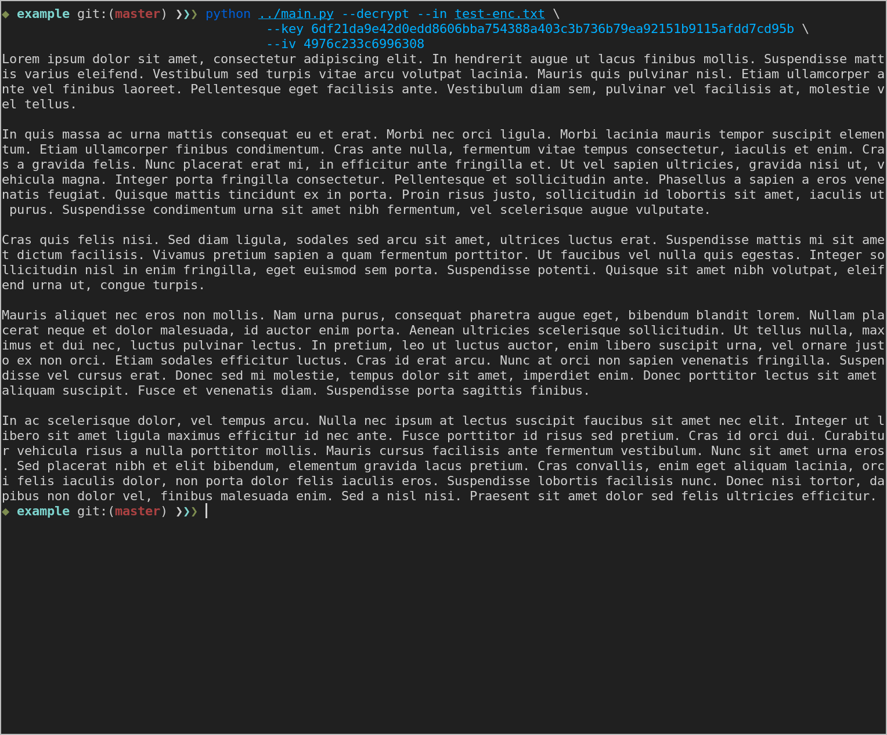

## Пример шифрования

При условии, что изначальный текст содержится в файле `test.txt`, а зашифрованный текст должен быть помещён в файл `test-enc.txt`, команда шифрования будет выглядеть следующим образом:

```sh
$ python ../main.py --in test.txt --out test-enc.txt
```

В результате файл `test-enc.txt` будет содержать зашифрованный текст, а на экран будут выведены шестнадцатеричные значения сгенерированных ключа шифрования (`KEY`) и синхропосылки (`IV`), например:

```
KEY = 6df21da9e42d0edd8606bba754388a403c3b736b79ea92151b9115afdd7cd95b
IV = 4976c233c6996308
```

## Пример расшифровывания

Обратная операция выполняется аналогичным образом, но помимо файла с зашифрованным текстом нужно также предоставить значения изначальных ключа шифрования и синропосылки:

```
$ python ../main.py --decrypt --in test-enc.txt \
    --key 6df21da9e42d0edd8606bba754388a403c3b736b79ea92151b9115afdd7cd95b \
    --iv 4976c233c6996308
```

В результате выполнения команды на экран будет выведен изначальный текст файла `test.txt`:


